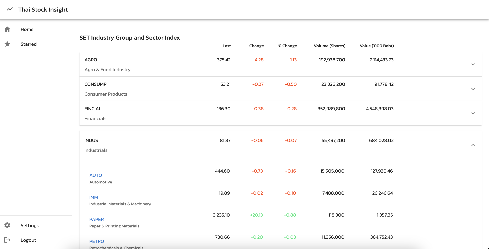

ThaiStock Insight is an accessible web application meticulously crafted to provide comprehensive stock market data sourced from the Stock Exchange of Thailand (SET).



First, run the development server:

```bash
npm run dev
# or
yarn dev
# or
pnpm dev
# or
bun dev
```

Open [http://localhost:3000](http://localhost:3000) with your browser to see the result.
